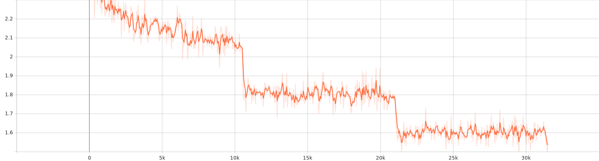
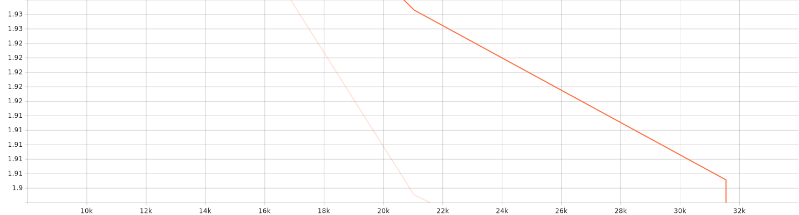

# Sequence2Sequence‑Transformer‑Translation

> A lean, modern baseline for neural machine translation (NMT) built on 🤗 Transformers, 🤗 Datasets, and 🤗 Evaluate — with sane defaults, strong metrics (BLEU & chrF), and a clean, hackable code layout.

<p align="center">
  
</p>

<div align="center">

**Python** `3.13+` • **Transformers** `4.42+` • **Datasets** `3.0+` • **Evaluate** `0.4.2+` • **TensorBoard** logging • **fp16** auto when CUDA is available

</div>

---

## 🚀 Model on Hugging Face

[](https://huggingface.co/Amirhossein75/Sequence2Sequence-Transformer-Translation-Opus-MT)

<p align="center">
  <a href="https://huggingface.co/Amirhossein75/Sequence2Sequence-Transformer-Translation-Opus-MT">
    
  </a>
</p>

---


## ✨ What’s inside

- **Encoder–decoder Seq2Seq** model via pretrained MarianMT checkpoints (e.g., `Helsinki-NLP/opus-mt-en-es`), easily swappable for any supported language pair.  
- **Batteries‑included data pipeline**: loads the OPUS Books dataset and ensures **train/validation/test** splits are present.  
- **Tokenization done right**: source/target are tokenized with `text_target=` to avoid label leaks and special‑token headaches.  
- **Solid evaluation**: **sacreBLEU** and **chrF** via 🤗 Evaluate, including average generated length.  
- **Trainer‑first ergonomics**: uses Hugging Face **Trainer** & **TrainingArguments** for robust, reproducible training.  
- **Clean module layout** you can understand at a glance and modify safely.


## Repo Structure
```

├── src/
│   ├── __init__.py
│   ├── config.py        # TrainConfig dataclass (defaults, device, dirs)
│   ├── data.py          # dataset loading & tokenization utilities
│   ├── metrics.py       # BLEU & chrF metrics for Trainer
│   ├── model.py         # model/tokenizer/data collator loaders
│   ├── predict.py       # pretty printed sample predictions
│   └── train.py         # end-to-end training pipeline (HF Trainer)
├──sagemaker/
│   ├── train_sagemaker.py     # training entry point (runs inside HF DLC)
│   ├── inference.py           # custom inference handler for endpoints
│   ├── launch_training.py     # submit a remote SageMaker training job
│   ├── deploy_endpoint.py     # stand up a real-time endpoint
│   ├── test_invoke.py         # send a test request to the endpoint
│   └── batch_transform.py     # offline inference over .jsonl files
├── requirements.txt
├── pyproject.toml
└── uv.lock              # optional: reproducible installs via uv
```

> **Defaults at a glance**
>
> - Language pair: **English → Spanish** (`en`→`es`)  
> - Dataset: **OPUS Books** (`Helsinki-NLP/opus_books`)  
> - Base model: **MarianMT** (`Helsinki-NLP/opus-mt-en-es`) if no model is specified  
> - Metrics: **sacreBLEU** and **chrF**  
> - Mixed precision: **fp16** automatically enabled when CUDA is available  
> - Logging: **TensorBoard** logs written under `outputs/.../logs`

---

## 🚀 Quickstart

### 0) Clone & enter the project

```bash
git clone https://github.com/amirhossein-yousefi/Sequence2Sequence-Transformer-Translation.git
cd Sequence2Sequence-Transformer-Translation
```

### 1) Create an environment & install deps

**Option A — pip (recommended):**
```bash
python -m venv .venv
source .venv/bin/activate  # Windows: .venv\Scripts\activate
pip install -r requirements.txt
```

**Option B — uv (fast, reproducible):**
```bash
# Requires uv: https://github.com/astral-sh/uv
uv venv
source .venv/bin/activate
uv pip install -r requirements.txt
```

> The `pyproject.toml` pins runtime requirements and marks this as a Python **3.13+** project.

### 2) Train (two ways)

#### A) From Python (most flexible)

```python
from transformers import TrainingArguments, Trainer
from src.config import TrainConfig
from src.model import load_model_and_tokenizer, get_data_collator
from src.data import load_and_prepare_dataset, tokenize_dataset
from src.metrics import build_compute_metrics
from src.predict import sample_predictions

# 1) Configure & resolve defaults
cfg = TrainConfig().resolve()   # en->es, opus_books, MarianMT, fp16 if CUDA

# 2) Model & tokenizer
model, tokenizer = load_model_and_tokenizer(cfg)

# 3) Data
raw_ds = load_and_prepare_dataset(cfg)                       # ensures train/valid/test
tok_ds = tokenize_dataset(raw_ds, tokenizer, cfg)            # applies text->ids

# 4) Trainer
args = TrainingArguments(
    output_dir=cfg.output_dir,
    per_device_train_batch_size=cfg.batch_size,
    per_device_eval_batch_size=cfg.batch_size,
    num_train_epochs=cfg.num_epochs,
    learning_rate=cfg.learning_rate,
    weight_decay=cfg.weight_decay,
    gradient_accumulation_steps=cfg.gradient_accumulation_steps,
    logging_steps=cfg.logging_steps,
    eval_strategy=cfg.evaluation_strategy,
    save_strategy=cfg.save_strategy,
    save_total_limit=cfg.save_total_limit,
    predict_with_generate=cfg.predict_with_generate,
    generation_max_length=cfg.generation_max_length,
    report_to=cfg.report_to,
    fp16=cfg.fp16,
    bf16=cfg.bf16,
)

trainer = Trainer(
    model=model,
    args=args,
    train_dataset=tok_ds["train"],
    eval_dataset=tok_ds["validation"],
    tokenizer=tokenizer,
    data_collator=get_data_collator(tokenizer, model),
    compute_metrics=build_compute_metrics(tokenizer),
)

# 5) Train / evaluate / predict
trainer.train()
metrics = trainer.evaluate()
print(metrics)

# A few qualitative samples
for line in sample_predictions(trainer, tokenizer, raw_ds["test"], tok_ds["test"], cfg, num_samples=5):
    print(line)

# (Optional) Save final artifacts
trainer.save_model(cfg.output_dir + "/final")
tokenizer.save_pretrained(cfg.output_dir + "/final")
```

#### B) As a script

`src/train.py` wires the exact same pipeline. You can run it directly or via module:

```bash
python -m src.train
# or
python src/train.py
```

> Tip: If you see an `ImportError: No module named 'src'`, run from the repository root or set `PYTHONPATH=.`, e.g. `PYTHONPATH=. python -m src.train`.

---

## 🔧 Customizing

### Change the language pair
Edit `src/config.py` or override in your script:
```python
cfg = TrainConfig(src_lang="de", tgt_lang="en").resolve()
```
By default the code derives the MarianMT checkpoint as:
```python
cfg.model_name = f"Helsinki-NLP/opus-mt-{cfg.src_lang}-{cfg.tgt_lang}"
```

### Use a specific model
Swap in any compatible seq2seq checkpoint from the Hub (T5, mBART, other OPUS‑MT variants, etc.):
```python
cfg = TrainConfig(model_name="Helsinki-NLP/opus-mt-tc-big-en-es").resolve()
```

### Pick a different dataset
Point to another Hugging Face dataset that exposes a `translation` column with your `src_lang`/`tgt_lang` keys:
```python
cfg = TrainConfig(dataset_name="wmt14", dataset_config="de-en").resolve()
```

### Tweak lengths & optimization
```python
cfg = TrainConfig(
    max_source_len=192,
    max_target_len=192,
    batch_size=16,
    num_epochs=5,
    learning_rate=3e-5,
).resolve()
```

---

## 📊 Metrics & logging

- **BLEU** via **sacreBLEU** and **chrF** are computed inside the Trainer loop and reported in eval logs.  
- Average generated length (`gen_len`) is included for sanity checking.  
- Logs land under `outputs/.../logs` for easy **TensorBoard** inspection:  
  ```bash
  tensorboard --logdir outputs
  ```

---

### 📉 Loss Curve

The following plot shows the training loss progression:




The following plot shows the validation loss progression:



*(SVG file generated during training(by tensorboard logs) and stored under `assets/`)*

## 🖥️ Training Hardware & Environment

- **Device:** Laptop (Windows, WDDM driver model)  
- **GPU:** NVIDIA GeForce **RTX 3080 Ti Laptop GPU** (16 GB VRAM)  
- **Driver:** **576.52**  
- **CUDA (driver):** **12.9**  
- **PyTorch:** **2.8.0+cu129**  
- **CUDA available:** ✅ 


## 📊 Training Logs & Metrics

- **Total FLOPs (training):** `4,945,267,757,416,448`  
- **Training runtime:** `2,449.291` seconds  
- **Logging:** TensorBoard-compatible logs in `src/outputs/mt_en_es_marian/logs`  

You can monitor training live with:

```bash
tensorboard --logdir src/outputs/mt_en_es_marian/logs
```
---


A transformer-based **encoder–decoder** sequence-to-sequence model was trained for **English → Spanish** translation.
This README summarizes training, evaluation, test metrics, qualitative samples, and how to reproduce or use the model.

---

## ✨ Eval/Test metric

- **BLEU (val/test):** 23.41 / 23.41  
- **chrF (val/test):** 48.20 / 48.21  
- **Loss (train/val/test):** 1.854 / 1.883 / 1.859  
- **Avg generation length (val/test):** 30.27 / 29.88 tokens  
- **Throughput:** train ≈ 12.90 steps/s · val ≈ 1.85 steps/s · test ≈ 1.84 steps/s  
- **Wall-clock:** train 40:45 · val 5:16 · test 5:18  

> Takeaway: the model produces fluent Spanish with moderate adequacy; BLEU ≈ 23.4 and chrF ≈ 48.2 indicate consistent performance across validation and test.

---

## 📊 Results

### Aggregate Metrics

| Split | Loss | BLEU | chrF | Gen Len | Runtime | Samples/s | Steps/s |
|:-----:|-----:|-----:|-----:|--------:|--------:|----------:|--------:|
| Train | 1.854 | — | — | — | 40:45 | 103.203 | 12.901 |
| Val   | 1.883 | 23.414 | 48.199 | 30.27 | 5:16 | 14.779 | 1.850 |
| Test  | 1.859 | 23.410 | 48.211 | 29.88 | 5:18 | 14.681 | 1.837 |

**Metrics definitions**  
- **BLEU / chrF:** quality w.r.t. references (higher is better).  
- **Gen Len:** average generated sequence length.  
- **Throughput:** samples/steps per second reported by the trainer.

---

## 🔎 Qualitative Samples (EN → ES)

**[0]**  
**SRC:** All around, the lonely sea extended to the limits of the horizon.  
**REF:** Todo alrededor del mar, absolutamente desierto, se extendía hasta los límites del cielo.  
**HYP:** En torno suyo, el mar solitario se extendía hasta los límites del horizonte.

**[1]**  
**SRC:** "With all due respect to master, they don't strike me as very wicked!"  
**REF:** No me parecen muy feroces.  
**HYP:** -A mí no me parecen muy malos, con el debido respeto al señor.

**[2]**  
**SRC:** "Greenland!" said he.  
**REF:** —Groenlandia —me dijo.  
**HYP:** -¡Groenland! -dijo-.

**[3]**  
**SRC:** To put the peasant to the proof Levin ordered the carts on which the hay was being moved to be fetched, and one of the stacks to be carried to the barn.  
**REF:** Para desenmascarar a los labriegos, mandó llamar a los carros que habían transportado el heno, ordenó que se cargase un almiar y se llevase a la era.  
**HYP:** Para probar al labrador, Levin ordenó que se llevasen los carros en los que se movía el heno y que se llevasen al pajar uno de los establos.

**[4]**  
**SRC:** And the two brave men gave three tremendous cheers in honor of their island!  
**REF:** Y los dos honrados colonos lanzaron tres formidables hurras en honor de la isla.  
**HYP:** ¡Y los dos valientes dieron tres hurras enormes en honor de su isla!


---

## 🚀 Quickstart (Inference)

```python
from transformers import AutoTokenizer, AutoModelForSeq2SeqLM

# 1) Replace with your checkpoint directory or Hub repo id
ckpt = "path/to/your-checkpoint"  # e.g., "username/en-es-seq2seq"

tok = AutoTokenizer.from_pretrained(ckpt, use_fast=True)
model = AutoModelForSeq2SeqLM.from_pretrained(ckpt)

def translate(texts, max_new_tokens=64, num_beams=4):
    inputs = tok(texts, return_tensors="pt", padding=True, truncation=True)
    outputs = model.generate(**inputs, max_new_tokens=max_new_tokens, num_beams=num_beams)
    return tok.batch_decode(outputs, skip_special_tokens=True)

print(translate(["All around, the lonely sea extended to the limits of the horizon."]))
```

---

## 🧪 Repro & Evaluation

```bash
# Install (pin versions as needed for your stack)
pip install torch transformers evaluate sacrebleu

# Evaluate with SacreBLEU (example)
python - <<'PY'
from sacrebleu import corpus_bleu, corpus_chrf
refs = [["Todo alrededor del mar, absolutamente desierto, se extendía hasta los límites del cielo."]]
hyps = ["En torno suyo, el mar solitario se extendía hasta los límites del horizonte."]
print("BLEU:", corpus_bleu(hyps, refs).score)
print("chrF:", corpus_chrf(hyps, refs).score)
PY
```

### ✅ TL;DR
- **Model**: `Helsinki-NLP/opus-mt-en-es` *(auto when `model_name=None`)*  
- **Dataset**: `opus_books` *(config: `en-es`)*  
- **Seed**: `42`  
- **Precision**: `fp16 = auto (True if CUDA)`, `bf16 = False`  
- **Output dir**: `outputs/mt_en_es_marian`

> ℹ️ “Auto” fields are resolved by `TrainConfig.resolve()` at runtime (e.g., `model_name`, `dataset_config`, paths, and `WANDB_DISABLED=true`).

---

### 🔧 Hyperparameters (by group)

#### Languages & Model
| Setting     | Value / Behavior |
|-------------|-------------------|
| `src_lang`  | `en` |
| `tgt_lang`  | `es` |
| `model_name`| `None` ⇒ resolves to `Helsinki-NLP/opus-mt-en-es` |
| `dataset_name` | `opus_books` |
| `dataset_config` | `None` ⇒ resolves to `en-es` |

#### Tokenization
| Setting          | Value |
|------------------|-------|
| `max_source_len` | `128` |
| `max_target_len` | `128` |

#### Optimization
| Setting                        | Value |
|--------------------------------|-------|
| `batch_size`                   | `8` |
| `num_epochs`                   | `3` |
| `learning_rate`                | `5e-5` |
| `weight_decay`                 | `0.01` |
| `gradient_accumulation_steps`  | `1` |
| `seed`                         | `42` |

#### Generation / Trainer
| Setting                  | Value |
|--------------------------|-------|
| `predict_with_generate`  | `True` |
| `generation_max_length`  | `128` |
| `evaluation_strategy`    | `epoch` |
| `save_strategy`          | `epoch` |
| `logging_steps`          | `50` |
| `save_total_limit`       | `2` |
| `metric_for_best_model`  | `bleu` |
| `greater_is_better`      | `True` |
| `report_to`              | `["tensorboard"]` |

#### Mixed Precision
| Setting | Value / Behavior |
|---------|-------------------|
| `fp16`  | **auto** ⇒ `True` if `torch.cuda.is_available()`; `False` otherwise |
| `bf16`  | `False` (enable on supported hardware if desired) |

#### I/O & Workflow
| Setting       | Value / Behavior |
|---------------|-------------------|
| `output_dir`  | `None` ⇒ resolves to `outputs/mt_en_es_marian` |
| `logging_dir` | `None` ⇒ resolves to `outputs/mt_en_es_marian/logs` |
| `do_train`    | `True` |
| `do_eval`     | `True` |
| `do_predict`  | `True` |

---

### 🧬 Resolved defaults (assuming **no CLI overrides**)

```json
{
  "src_lang": "en",
  "tgt_lang": "es",
  "model_name": "Helsinki-NLP/opus-mt-en-es",
  "dataset_name": "opus_books",
  "dataset_config": "en-es",
  "max_source_len": 128,
  "max_target_len": 128,
  "batch_size": 8,
  "num_epochs": 3,
  "learning_rate": 5e-5,
  "weight_decay": 0.01,
  "gradient_accumulation_steps": 1,
  "seed": 42,
  "predict_with_generate": true,
  "generation_max_length": 128,
  "evaluation_strategy": "epoch",
  "save_strategy": "epoch",
  "logging_steps": 50,
  "save_total_limit": 2,
  "metric_for_best_model": "bleu",
  "greater_is_better": true,
  "report_to": ["tensorboard"],
  "fp16": "auto (True if CUDA, else False)",
  "bf16": false,
  "output_dir": "outputs/mt_en_es_marian",
  "logging_dir": "outputs/mt_en_es_marian/logs",
  "do_train": true,
  "do_eval": true,
  "do_predict": true,
  "WANDB_DISABLED": "true (set in code)"
}
```

> Note: `fp16` is **environment‑dependent** by default. If you need an explicit setting for cross‑machine reproducibility, see the commands below.

---

### 🧪 Exact reproduction commands

> Use **one** of the following. If you ran with custom flags, copy your values into these commands.

#### 1) GPU (FP16) — match defaults explicitly
```bash
python -m src.train   --src_lang en --tgt_lang es   --dataset_name opus_books --dataset_config en-es   --max_source_len 128 --max_target_len 128   --batch_size 8 --num_epochs 3   --learning_rate 5e-5 --weight_decay 0.01   --gradient_accumulation_steps 1 --seed 42   --generation_max_length 128   --evaluation_strategy epoch --save_strategy epoch   --logging_steps 50 --save_total_limit 2   --metric_for_best_model bleu   --fp16   --output_dir outputs/mt_en_es_marian   --logging_dir outputs/mt_en_es_marian/logs   --do_train --do_eval --do_predict
```

#### 2) CPU (no mixed precision)
```bash
python -m src.train   --src_lang en --tgt_lang es   --dataset_name opus_books --dataset_config en-es   --max_source_len 128 --max_target_len 128   --batch_size 8 --num_epochs 3   --learning_rate 5e-5 --weight_decay 0.01   --gradient_accumulation_steps 1 --seed 42   --generation_max_length 128   --evaluation_strategy epoch --save_strategy epoch   --logging_steps 50 --save_total_limit 2   --metric_for_best_model bleu   --output_dir outputs/mt_en_es_marian   --logging_dir outputs/mt_en_es_marian/logs   --do_train --do_eval --do_predict
```

> ⚠️ Because `--fp16`/`--bf16` are `store_true` flags, you **cannot** explicitly pass `False` via CLI. To force `fp16=False` on a CUDA machine, remove `--fp16` and ensure the default in code does not auto‑enable it, or edit the argument to accept explicit booleans.

---


## 🧠 Background & design notes

- The project uses the **Transformer** encoder–decoder architecture popularized by *Attention Is All You Need* (Vaswani et al., 2017).  
- We start from a strong **pretrained MT model (MarianMT / OPUS‑MT)** and **fine‑tune on OPUS Books**, a lightweight, parallel text dataset great for tutorials and fast iteration.  
- The training loop is implemented with the Hugging Face **Trainer** API for correctness and minimal boilerplate, while remaining fully swappable if you want to write a custom loop.  
- Defaults aim for **reproducibility** (`seed=42`), **sensible generation** (`predict_with_generate=True`), and **mixed precision** out of the box.

---

## 🗂️ Repository layout

- `src/config.py` — `TrainConfig` dataclass centralizes all knobs (languages, dataset, lengths, optimization, logging, IO) and resolves derived paths; enables `fp16` automatically if CUDA is present.  
- `src/data.py` — `load_and_prepare_dataset` ensures `train/validation/test` availability (splitting when necessary) and `tokenize_dataset` builds a batched `preprocess` mapper using `text_target=` for labels.  
- `src/model.py` — `load_model_and_tokenizer` loads the checkpoint and tokenizer; `get_data_collator` returns a `DataCollatorForSeq2Seq` for dynamic padding and label shifting.  
- `src/metrics.py` — wraps 🤗 Evaluate to compute **sacreBLEU** and **chrF**, with robust post‑processing.  
- `src/predict.py` — `sample_predictions` prints `SRC/REF/HYP` triplets for a quick qualitative check.  
- `src/train.py` — end‑to‑end glue around **Trainer** / **TrainingArguments** for training and evaluation.

---

## 🧪 Repro tips

- Fix the RNG seed in `TrainConfig` (default `42`).  
- Keep `save_total_limit` small to avoid disk bloat.  
- Always compare both **BLEU** *and* **chrF**; chrF often correlates better with perceived quality for morphologically rich languages.  
- When switching language pairs, verify the dataset has the exact keys (`cfg.src_lang`, `cfg.tgt_lang`) under its `translation` column.

---

## ❓ FAQ

**Q: Do I need a GPU?**  
A: No, but it helps a lot. fp16 will be enabled automatically when CUDA is available.

**Q: Can I push models to the Hub?**  
A: Yes — call `trainer.push_to_hub()` once authenticated, or use the `huggingface_hub` CLI.

**Q: My dataset has only a `train` split.**  
A: The loader will carve out **validation**/**test** (90/5/5) from `train` automatically.

**Q: How do I evaluate on my own files?**  
A: Create a small 🤗 Datasets `Dataset` with a `translation` column and your language keys, then run `trainer.predict(...)` or the helper in `src/predict.py`.

---

# SageMaker: Train, Deploy, and Inference

This add‑on lets you **train** the translation model on Amazon SageMaker, **deploy** it as a real‑time endpoint (or **Batch Transform**), and **invoke** it with a simple JSON schema — without changing the repo’s core code.

> Works with the repo’s default MarianMT‑based English→Spanish setup but also supports other language pairs and checkpoints.

---

## What include

- **Training** uses the Hugging Face DLC for PyTorch and saves artifacts to `/opt/ml/model` (`SM_MODEL_DIR`), which SageMaker exports to S3 automatically.
- **Real‑time inference** uses either:
  - the **custom handler** in `sagemaker/inference.py` (recommended for consistent translation schema), or
  - the default **HF pipeline** by setting `HF_TASK=translation`.
- **Batch Transform** consumes JSON Lines (`.jsonl`) inputs for large offline jobs.

> The DLC versions referenced here match Hugging Face’s current public list of available Docker images (training on Transformers **4.49.0**, inference on **4.51.3**). See the official tables for the latest URIs and versions. citeturn12view0

---

## Prerequisites

- An AWS account with SageMaker permissions and an **execution role ARN**.
- The **SageMaker Python SDK** installed *locally or in SageMaker Studio*:

```bash
pip install --upgrade sagemaker boto3
```

- (Optional) If you’ll launch jobs from your laptop, configure `awscli` with credentials.

> SageMaker passes key paths and configuration via environment variables like `SM_MODEL_DIR` and `SM_CHANNEL_*`, and forwards hyperparameters as CLI args to your script. Transformers’ `Trainer` will save the model under `/opt/ml/model` so SageMaker can package it as `model.tar.gz`.

---

## 1) Launch a training job

Run from the **repo root** (so `src/` is included):

```bash
python sagemaker/launch_training.py \
  --role arn:aws:iam::<ACCOUNT_ID>:role/<YourSageMakerExecutionRole> \
  --bucket <your-sagemaker-bucket> \
  --instance-type ml.g5.2xlarge \
  --job-name mt-en-es-$(date +%Y%m%d-%H%M) \
  --src-lang en --tgt-lang es \
  --epochs 3 --train-batch-size 8 --eval-batch-size 8
```

What this does:

- Creates a `HuggingFace` **Estimator** and sends the code to a managed training container (Transformers **4.49.0**, PyTorch **2.5**, Python **3.11**).
- Runs `sagemaker/train_sagemaker.py`, which imports your repo’s `src/` modules and trains via the HF `Trainer`.
- Saves final artifacts to `/opt/ml/model` so SageMaker uploads them to S3 (you’ll see the S3 path in the logs).

Hyperparameters you can override include: `--model-name`, `--dataset-name`, `--dataset-config`, `--epochs`, `--train-batch-size`, `--lr`, `--grad-accum`, `--gen-max-len`, and more (see the launcher script).

---

## 2) Deploy a real‑time endpoint

**Option A: from a training job** (recommended, uses that job’s `model.tar.gz` automatically):

```bash
python sagemaker/deploy_endpoint.py \
  --from-training <training-job-name> \
  --endpoint-name translate-en-es \
  --instance-type ml.m5.xlarge
```

**Option B: from an S3 artifact** (`model.tar.gz`):

```bash
python sagemaker/deploy_endpoint.py \
  --model-data s3://<bucket>/path/to/model.tar.gz \
  --endpoint-name translate-en-es \
  --instance-type ml.m5.xlarge
```

By default the script uses our custom handler (`sagemaker/inference.py`) to ensure stable request/response. To use the “zero‑code” HF pipeline instead, add `--use-default-pipeline` (sets `HF_TASK=translation`). See the official docs for both paths and how the inference toolkit resolves tasks.

---

## 3) Invoke the endpoint

```bash
python sagemaker/test_invoke.py --endpoint-name translate-en-es \
  --text "The sea extends to the horizon."
```

**Request (JSON):**

```json
{
  "inputs": "The sea extends to the horizon.",
  "parameters": {"max_new_tokens": 64, "num_beams": 4, "do_sample": false}
}
```

**Response:** the standard HF translation output (list of dicts with `translation_text`).

> If you use the custom handler, it implements `model_fn` and `transform_fn` — the recommended hooks supported by the Hugging Face Inference Toolkit inside SageMaker. citeturn6view0

---

## 4) Batch (offline) inference

Prepare a **`.jsonl`** file on S3, one JSON per line:

```text
{"inputs":"Hello, world!"}
{"inputs":"How are you?"}
```

Then run:

```bash
python sagemaker/batch_transform.py \
  --model-data s3://<bucket>/path/to/model.tar.gz \
  --input s3://<bucket>/inputs/translate.jsonl \
  --output s3://<bucket>/outputs/translate/
```

---

## 📚 References & acknowledgments

- Vaswani et al., **Attention Is All You Need** (NeurIPS 2017).  
- **Helsinki‑NLP OPUS‑MT** MarianMT checkpoints (e.g., `Helsinki-NLP/opus-mt-en-es`).  
- **OPUS Books** dataset (`Helsinki-NLP/opus_books`).  
- Hugging Face **Transformers** — **Trainer**, **Translation task guide**.  
- Hugging Face **Evaluate** — **sacreBLEU** and **chrF** metrics.

---

## 🙌 Contributing

Issues and PRs are welcome — especially new language‑pair recipes, evaluation scripts, and docs fixes.

---

## 🔒 License

If you plan to use this code in your own work or redistribute it, please add a license file to the repository.

